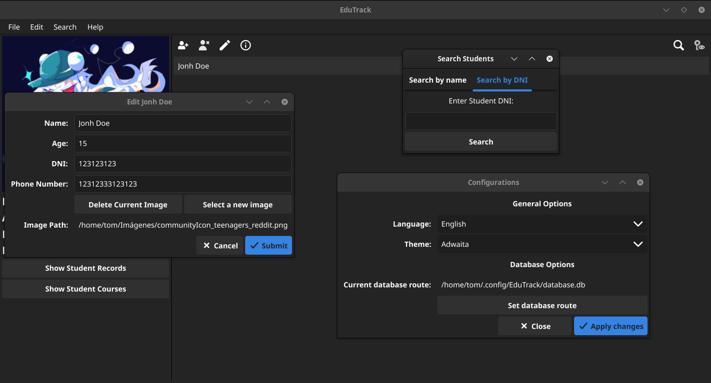
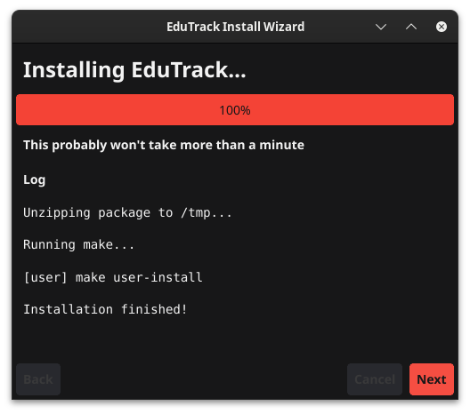

# EduTrack

[](https://choosealicense.com/licenses/mit/)


This is a program that manages a database of students and courses.

## Features

- Light/dark mode.
- Fullscreen mode.
- Cross platform.
- User profile pictures and detailed fields to fill out.
- SQLite managed database.
- Embedded SQLite (no additional installations required).
- Multilanguage support
- Multithemes support

## Screenshots



## Installation

### You can install it downloading and executing the installer

**Note:** Only windows and linux are supported



Install my-project with go or by executing the binary in its own folder

Install with go:

```bash
git clone https://github.com/Tom5521/EduTrack 
go install cmd/EduTrack/main.go
```

You can compile it, you need:

- C compiler
- Go compiler
- wget
- xz (on linux)
- winrar/7zip (on windows)
- Git
- Fyne Package (Optionally)

Compiling and installing in Linux

```bash
git clone https://github.com/Tom5521/EduTrack
git checkout <latest version>
make user-install # make install for root installation
```

On Windows

```batch
git clone https://github.com/Tom5521/EduTrack
git checkout <latest version>
go run -tags release scripts/main.go -compile-to-windows
# Go to builds folder and unzip EduTrack-win64.zip
# Then run the executable, and done!
# The windows(and linux executable is fully portable)
```

You can also download the binaries and unzip them, to run them in a portable way,
or installing with make install in linux

## Optimizations

- Change the use of raw SQL to GORM (I reduced ~1000 lines of code).
- Change the use of buttons to toolbars
- Improve data handling and data uploading
- Switching from storing data in yml files to SQLite files
- Improve packaging scripts for distribution.
- Move the data library that can be imported from other projects to modify databases and make scripts in general!

## Running Tests

To run tests, run the following command

```bash
  go test -v ./tests/data/
  go test -v -tags delete ./tests/data/
```

## Roadmap

### Nothing interesting for now... it would be better to check the [releases](https://github.com/Tom5521/EduTrack/releases)

## Support

For support open an issue or message me through my [reddit](https://www.reddit.com/u/Sad-Technician3861)!
Or send me a [email](mailto:thomas.bored5521@gmail.com)!

## Notes

There is a very high chance that the program will be detected as false positive in windows,
here is the virustotal scan of the
[linux](https://www.virustotal.com/gui/file/0a8fd17aa67cdd287cb95411c316032b633d5041cbbb6942a05c44e31af1dbd9)
and
[windows](https://www.virustotal.com/gui/file/5aacc038cd20e0f5187526e5073413291df5af35ceb8939b256bc0c0df3fc6b8)
version

And [here](https://go.dev/doc/faq#virus) is a explanation of the problem

And [here](https://www.reddit.com/r/golang/comments/189kd0x/running_for_range_loop_and_windows_defender_says/)
an example of it

## License

[MIT](https://choosealicense.com/licenses/mit/)
