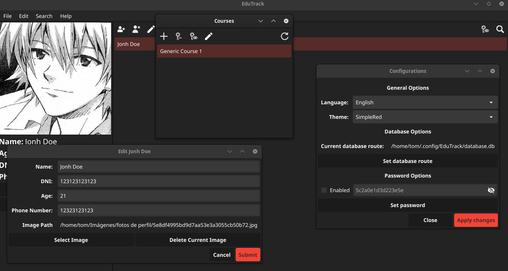

# EduTrack

[](https://choosealicense.com/licenses/mit/)


This is a program that manages a database of students and courses.

## Features

- Light/dark mode.
- Fullscreen mode.
- Cross platform.
- User profile pictures and detailed fields to fill out.
- SQLite managed database.
- Embedded SQLite (no additional installations required).
- Multilanguage support
- Multithemes support

## Screenshots



## Installation

Install my-project with go or by executing the binary in its own folder

Install with go:

```bash
go install github.com/Tom5521/EduTrack@latest
```

You can compile it, you need:

- Python (Optionally)
- C compiler
- Go compiler
- xz (on linux)
- winrar/7zip (on windows)
- Git

Compiling in Linux

```bash
git clone https://github.com/Tom5521/EduTrack
git checkout <latest version>
python scripts/Build linux
cd builds
tar -xf EduTrack-linux64.tar.xz
cd EduTrack-linux64
make user-install # You can make a root install with "sudo make install"
```

On Windows

```bash
git clone https://github.com/Tom5521/EduTrack
git checkout <latest version>
python scripts/Build win
# Go to builds folder and unzip EduTrack-win64.zip
# Then run the executable, and done!
# The windows(and linux executable is fully portable)
```

You can also download the binaries and unzip them, to run them in a portable way,
or installing with make install in linux

## Optimizations

- Change the use of raw SQL to GORM (I reduced ~1000 lines of code).
- Change the use of buttons to toolbars
- Improve data handling and data uploading
- Switching from storing data in yml files to SQLite files
- Improve packaging scripts for distribution.
- Move the data library that can be imported from other projects to modify databases and make scripts in general!

## Running Tests

To run tests, run the following command

```bash
  go test -v ./tests/data/
  go test -v -tags delete ./tests/data/
```

## Roadmap

- Add password protection for modifying the database

- Improve the graphic management system of grades and records

## Support

For support open an issue or message me through my [reddit](https://www.reddit.com/u/Sad-Technician3861)!

## Lessons Learned

- More advanced pointer handling
- More knowledge with the fyne framework and improve my knowledge regarding containers and layouts.
- Handling raw SQL in go.
- Management and adaptation to GORM.
- Improve the file structure of projects.
- Good practices in the Go language.
- Basic use of github actions.

## License

[MIT](https://choosealicense.com/licenses/mit/)
